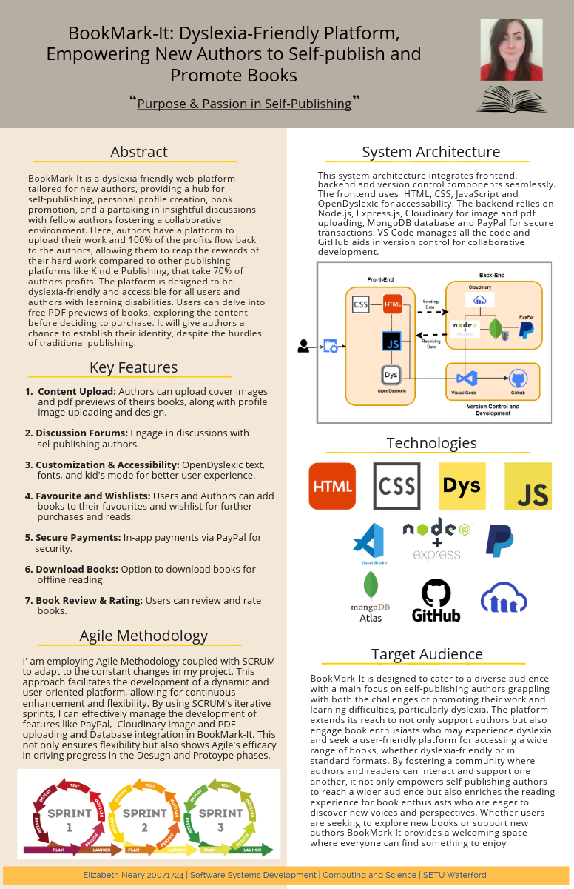

# Elizabeth Neary

- **Student Number:** 20071724

## Project Titles

1. **Academic Title:**
   - BookMark-It: Dyslexia-Friendly platform, Empowering new authors to self-publish and promote books.

2. **Commercial Title:**
   - Purpose & Passion in Publishing

## Project Description

BookMark-It: Revolutionizing the publishing scene for new authors, this dyslexia-friendly web platform is a comprehensive hub for self-publishing, personal profile creation, book promotion, and engaging discussions. Authors retain 100% of their profits, fostering a supportive and collaborative environment. With a focus on accessibility and availability to a wide range of books, BookMark-It empowers all users, especially those with learning disabilities. BookMark-It provides authors with the opportunity to establish their unique identity and overcome the challenges of traditional publishing.

 

## Project Landing Page

- [Poster]()
- [Demo Video](link-to-demo-video)
- [GitHub Repo](https://github.com/lizNe/bookmark-it)

